# Monitor Infrastructure (Host Metrics) with OpenTelemetry

## Windows
Download and install the `otelcol-contrib` using the MSI file. You may need to run as an administrator to collect all process metrics. You can start and stop the `otelcol-contrib` service using `services.msc`.

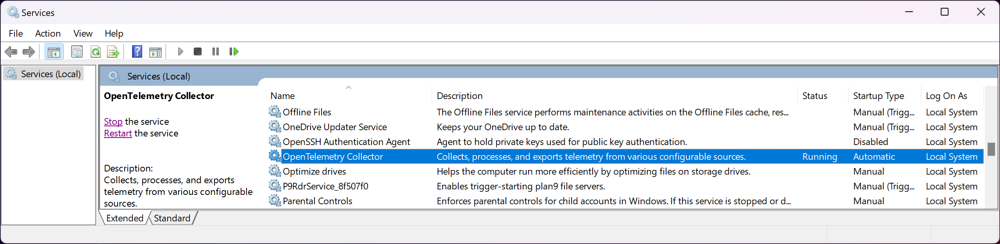

Check the `otelcol-contrib` service properties. You may change the log on to a service account with privileges to collect more process metrics.

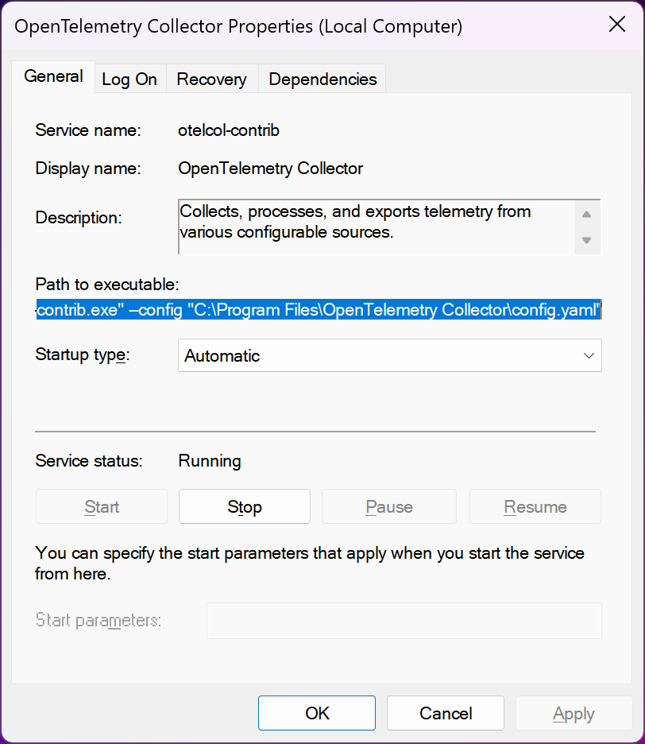

You can find the `config.yaml` file in `C:\Program Files\OpenTelemetry Collector` by default.

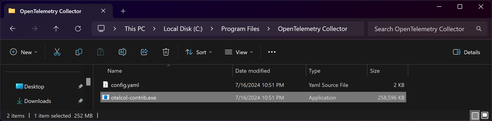

You may also run the collector manually with the following command:
```powershell
& 'C:\Program Files\OpenTelemetry Collector\otelcol-contrib.exe' --config=file:'C:\Program Files\OpenTelemetry Collector\otel-config_windows.yaml'
```

If you have the `health_check` extention, you can check the status of the collector at http://localhost:13133 

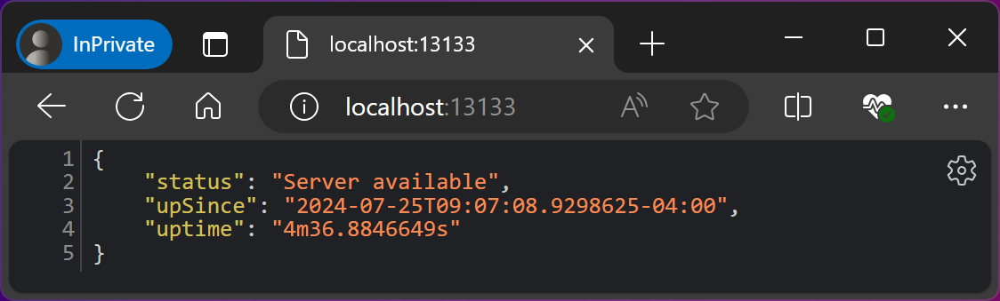

You can uninstall the OpenTelemetry collector in Windows as usual from ther Control Panel.

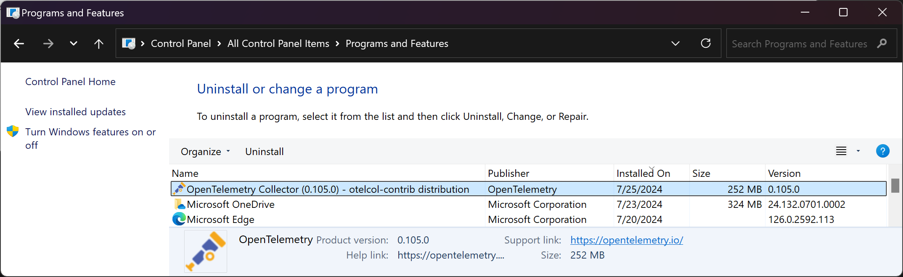

If the collector does not start, or you get an error, try running the collector manually from the terminal to see detailed error messages.  It's usually spacing in the YAML file that breaks it, or components not listed under the service pipelines.

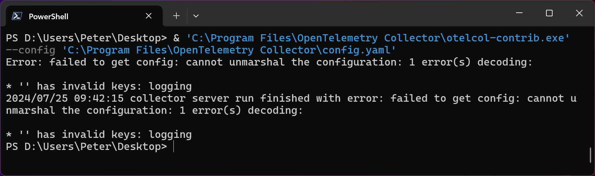

Other troubleshooting tips include making sure `otelcol-contrib` is allowed through the firewall.

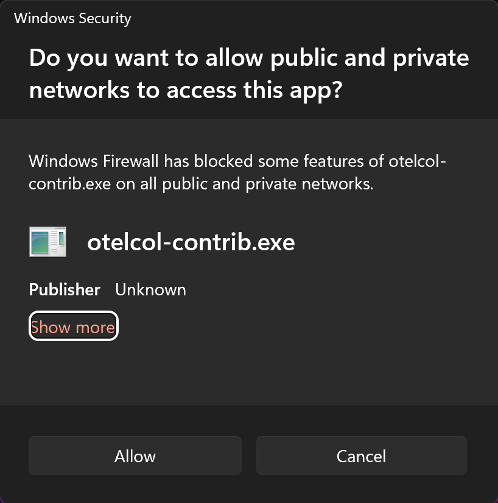

If everything is running correctly, the entity in New Relic should look no different from the Infrastructure agent.  Note the `instrumentation.providoer: opentelemetry` in the tags.

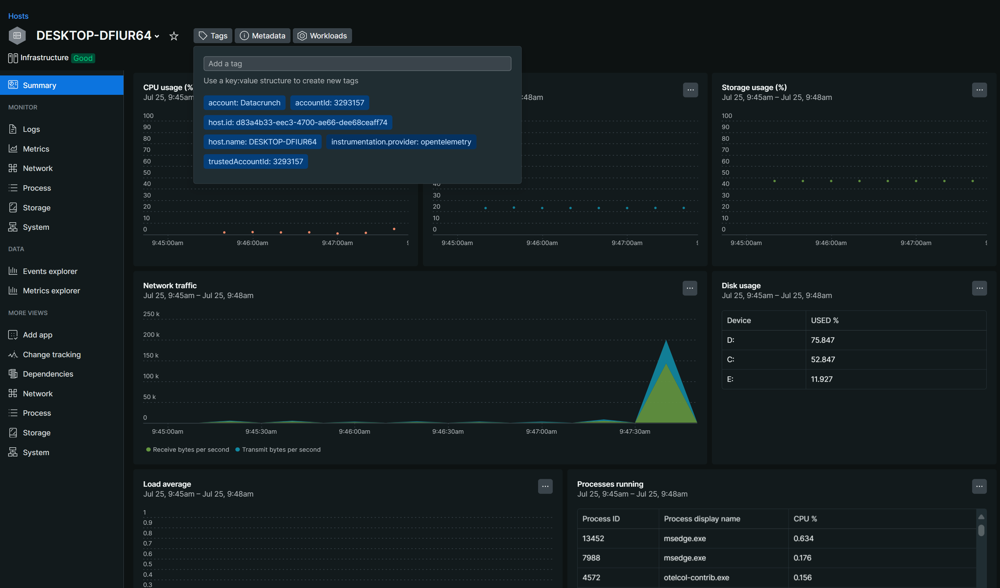

If you're missing some process metrics, try running the collector again as an Administrator in the terminal. Otherwise, change the service account being used that has elevated permissions.

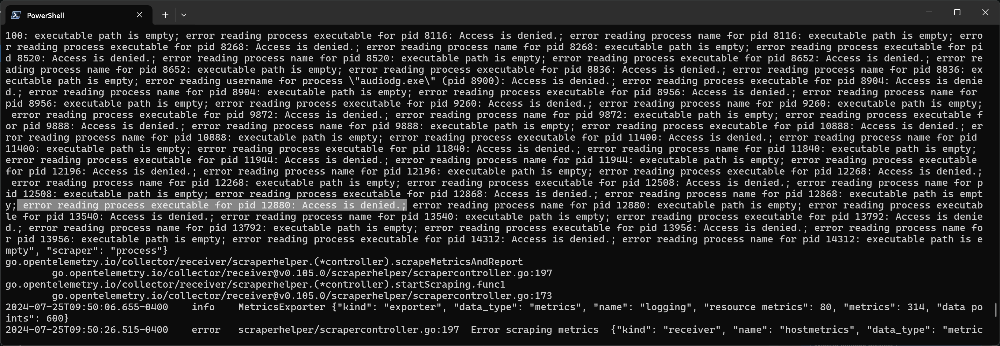

## Linux
Depending on which flavor of Linux, there should already be an `otelcol-contrib` package that can be installed with a package manager with services created already. Otherwise, run manually:
```bash
sudo /home/pi/otel/otelcol-contrib --config=file:"/home/pi/otel/otel-config_linux.yaml"
```
## Mac
Download and extract `otelcol-contrib` from the `.tar.gz` file and run manually.

Before you run it, open the file with the terminal first to get past security messages.

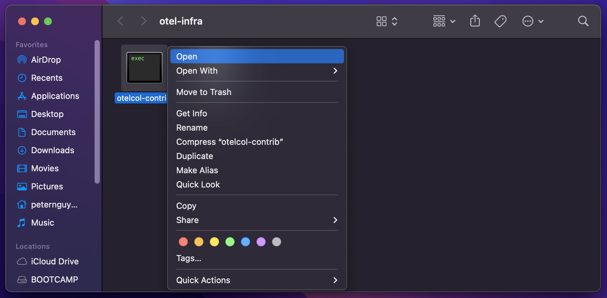

When prompted, open it.


Run manually with the following command:
```bash
./otelcol-contrib --config=file:./otel-config_mac.yaml
```

You may be prompted to allow this through your firewall.

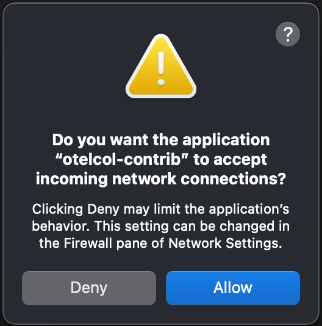

If everything is working correctly, it should look no different from the infrastructure agent in New Relic.

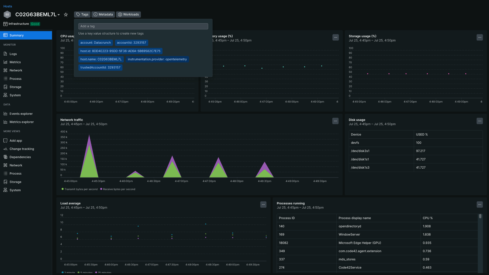

