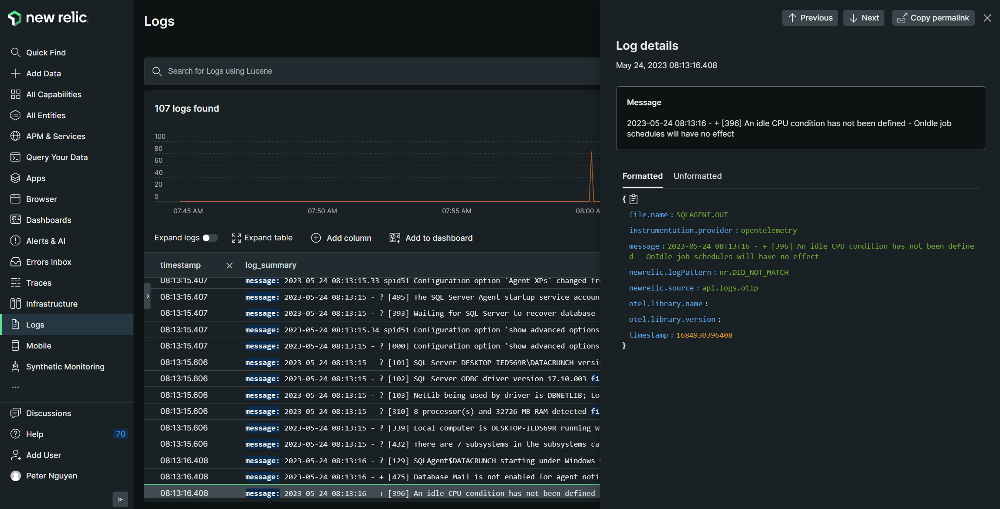
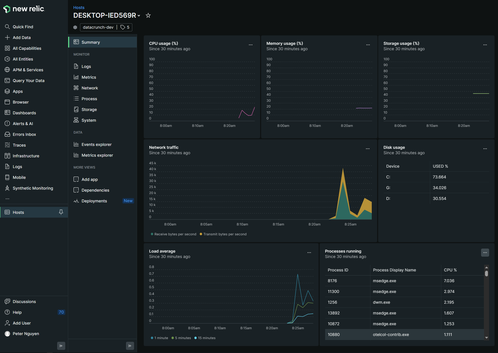
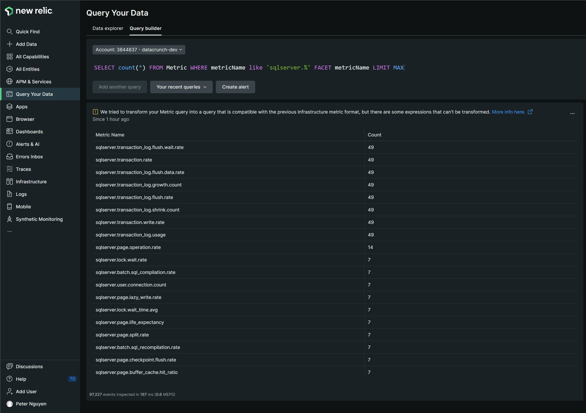
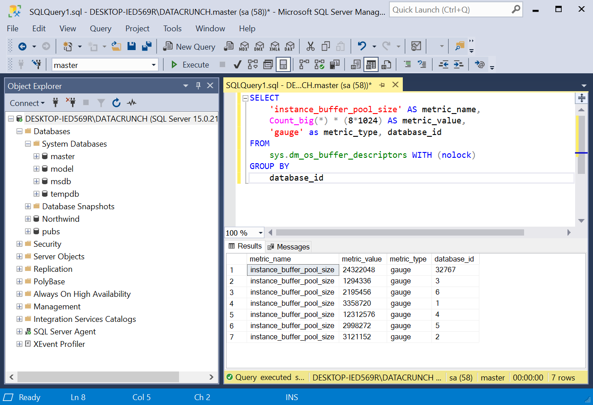
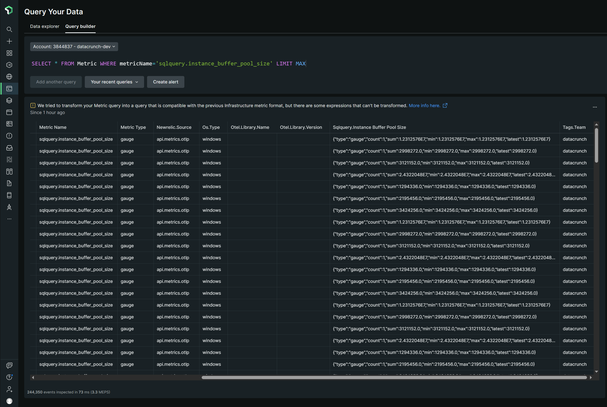

# Monitor Microsoft SQL Server with OpenTelemetry

## Logs
Micorosft SQL Server logs can be found in UTF-16 LE encoded files.  The `filelog` receiver supports this encoding, as well as others.  In New Relic, which supports UTF-8 logs, is able to show the logs properly in the Logs UI.

## Infrastructure
Using the `hostmetrics` receiver gets infrastructure metrics into New Relic.  Original configuration for this can be found here: https://docs.newrelic.com/docs/more-integrations/open-source-telemetry-integrations/opentelemetry/collector/opentelemetry-collector-infra-hosts/

## SQL Server
To get SQL Server specific metrics, the `sqlserverreceiver` scrapes Windows counters and can get various metrics. Details here: https://github.com/open-telemetry/opentelemetry-collector-contrib/blob/main/receiver/sqlserverreceiver/documentation.md

## Custom Queries
To get custom queries, use the `sqlquery` receiver to define metrics.  Examples of custom queries can be found here: https://github.com/newrelic/nri-mssql/blob/master/mssql-custom-query.yml.sample

Add attributes/tags as needed.
