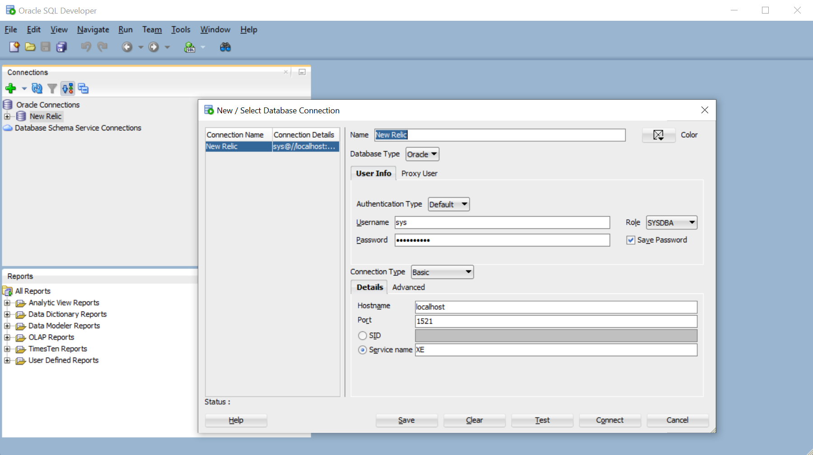
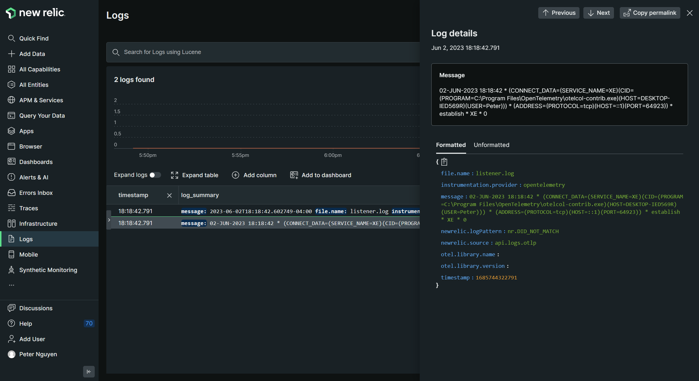
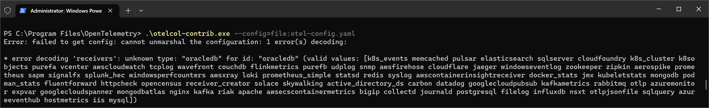
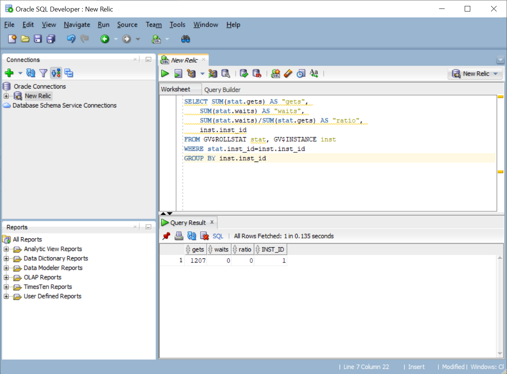
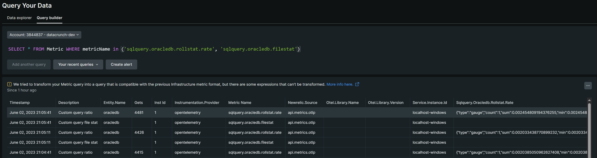
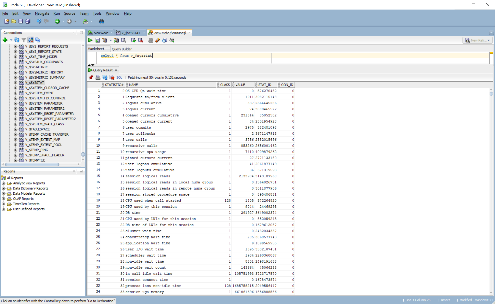
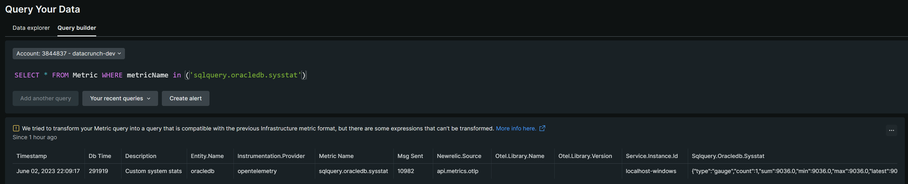

# Oracle DB Monitoring with OpenTelemetry

Use the included `otel-config_oracledb.yaml` to get started.  If you're unsure how to format the credentials, try logging in with Oracle SQL Developer or Azure Data Studio. 


## Logs
There are log files everywhere, and they usually end with `.log`.  These logs are UTF-8 encoded, so no issues here.


## Database Metrics
As of `otelcol-contrib.exe` v0.77 the OracleDB receiver is not available.  We'll skip the `oracledb` receiver for now, we can still get these metrics elsewhere.


| | | | |
|:----|:----|:----|:----|
|active_directory_ds|filelog|mongodb|signalfx|
|aerospike|flinkmetrics|mongodbatlas|skywalking|
|apache|fluentforward|**mysql**|snmp|
|awscloudwatch|googlecloudpubsub|nginx|solace|
|awscontainerinsightreceiver|googlecloudspanner|nsxt|splunk_hec|
|awsecscontainermetrics|hostmetrics|opencensus|**sqlquery**|
|awsfirehose|httpcheck|otlp|**sqlserver**|
|awsxray|iis|otlpjsonfile|statsd|
|azureeventhub|influxdb|podman_stats|syslog|
|azuremonitor|jaeger|**postgresql**|tcplog|
|bigip|jmx|prometheus|udplog|
|carbon|journald|prometheus_simple|vcenter|
|cloudflare|k8s_cluster|pulsar|wavefront|
|cloudfoundry|k8s_events|purefa|windowseventlog|
|collectd|k8sobjects|purefb|windowsperfcounters|
|couchdb|kafka|rabbitmq|zipkin|
|datadog|kafkametrics|receiver_creator|zookeeper|
|docker_stats|kubeletstats|redis| |
|elasticsearch|loki|riak| |
|expvar|memcached|sapm| |


## Custom Queries
You can find some example custom queries here:
- https://github.com/newrelic/nri-oracledb/blob/master/oracledb-config.yml.sample#L39-L44
- https://github.com/newrelic/nri-oracledb/blob/master/oracledb-custom-query.yml.sample#L4-L12

**IMPORTANT**: Many system tables and views in Oracle have a `$` (dollar sign) character in them.  For example, `V_$SYSSTAT`.  To use queries with `$` in the YAML file, you'll need to escape this with another `$` so that it looks like `V_$$SYSSTAT`.

Try this on your own Oracle instance to make sure they work.




## Database Metrics Revisited
To get the metrics from the `oracledb` receiver in Windows, we'll need to run a custom query on `V_$SYSSTAT`.


However, notice it's not in a format we can easily use for the custom query in the YAML file, so we'll need to transpose the table to get 1 row with all of the metrics we need.  As long as you know the name of the metric you want, add it to the bottom of the query.

```sql
select * from (select NAME as "metric", VALUE as "result" from v_$$sysstat)
pivot (max("result") for "metric" in (
'DB time' as "dbTime",
'CPU used by this session' as "cpuTime",
'messages sent' as "msgSent"
))
```



Try not to add too many in a single query, in case attribute limits, cardinality, and so on.