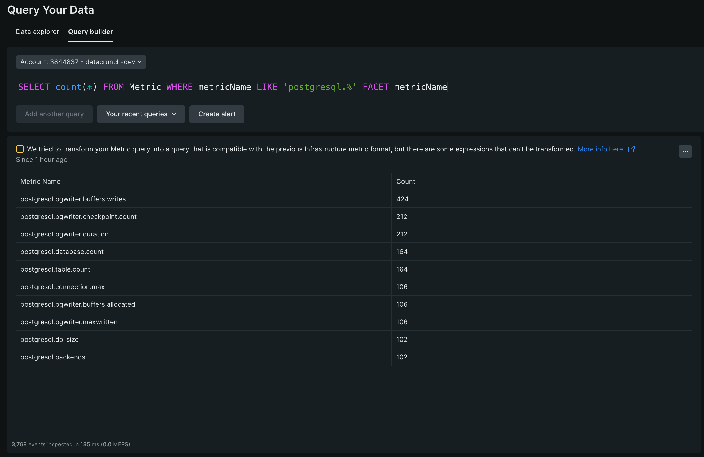
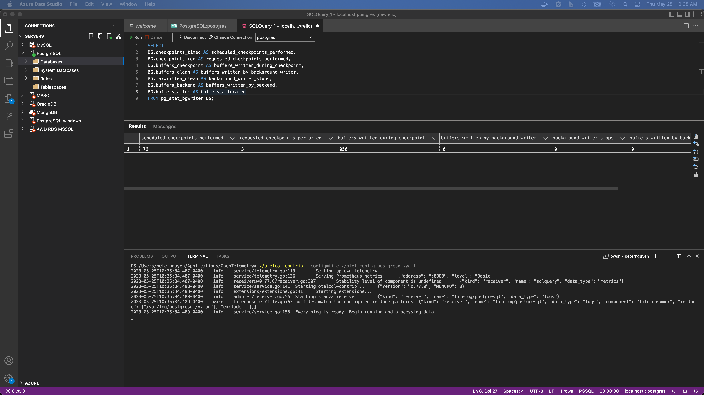
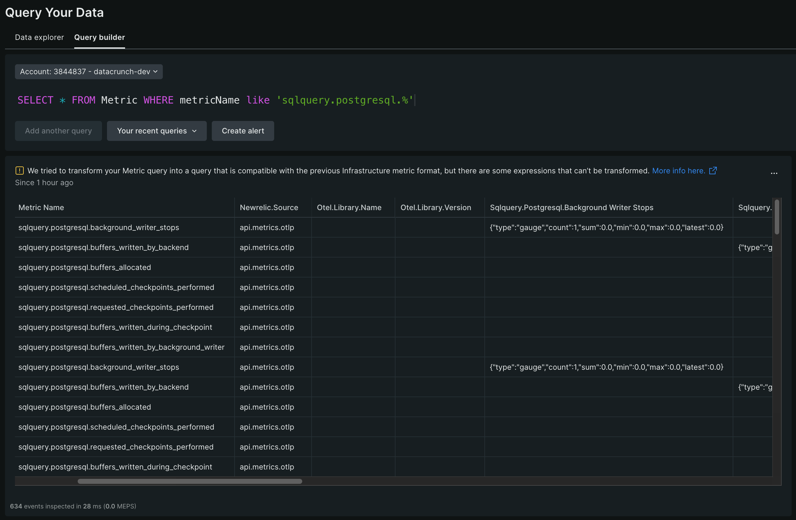
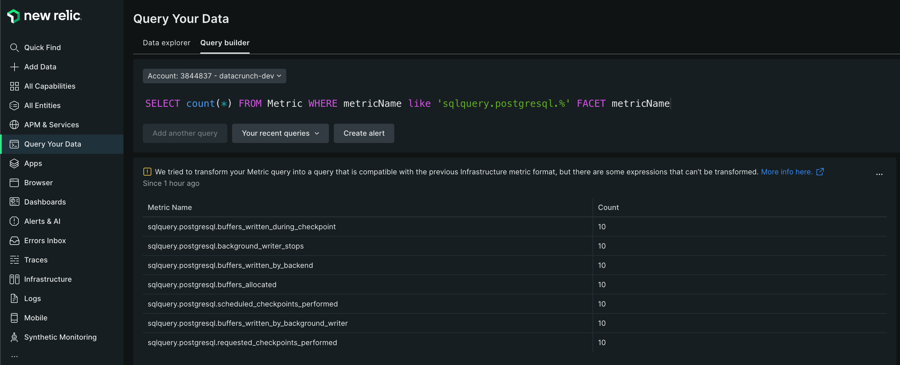

# Monitor PostgreSQL with OpenTelemetry

To begin, you’ll need an instance of PostgreSQL you can connect to.  If you don’t have one yet, you can create an instance with Docker to get started.
```powershell
docker run --name postgresql -p 5432:5432 -v /data:/var/lib/postgresql/data -e POSTGRES_USER=newrelic -e POSTGRES_PASSWORD=NewRelic1! -c log_statement=all -d postgres:latest
```

## Logs
We use the filelog receiver to tail log files ending with .log in the /var/log/postgresql/ directory.  Log file location may vary, change as needed.  More details on log parsing here: https://github.com/open-telemetry/opentelemetry-collector-contrib/tree/main/receiver/filelogreceiver

## Metrics
We use the `postgresqlreceiver` to collect metrics on the PostgreSQL server.  You can monitor multiple PostgreSQL by adding more receivers and putting a label on them. Details on metrics can be found here: https://github.com/open-telemetry/opentelemetry-collector-contrib/blob/main/receiver/postgresqlreceiver/metadata.yaml



## Custom Queries
To run custom queries, we use the `sqlqueryreceiver` to define connection string and query to run.  Then, we specify which columns to turn into a metric.  In this example, we use a custom query found here: https://github.com/newrelic/nri-postgresql/blob/master/postgresql-custom-query.yml.sample



Similar to the `postgresqlreceiver`, you can add multiple servers or databases to query from.



Rename metrics if needed to re-use exisiting dashboard templates.
