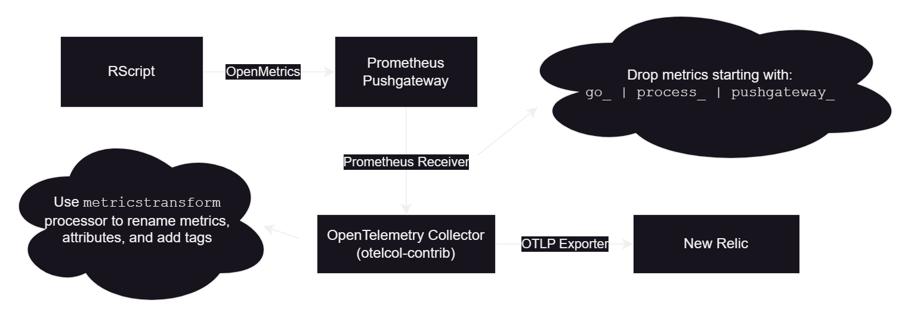
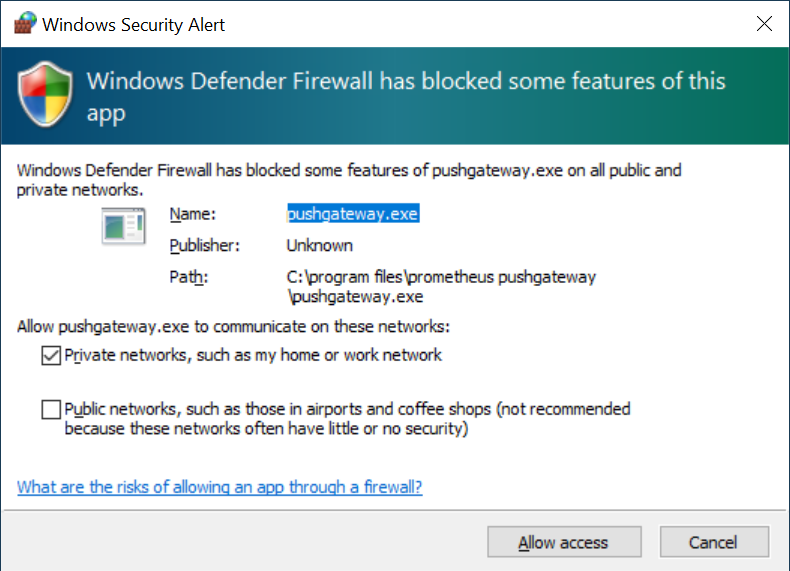
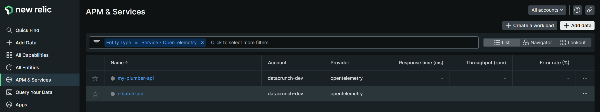
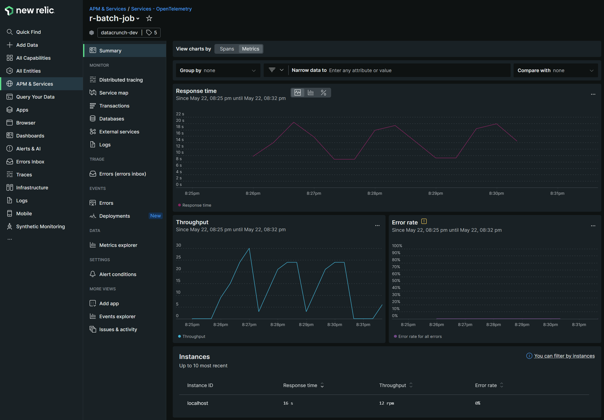
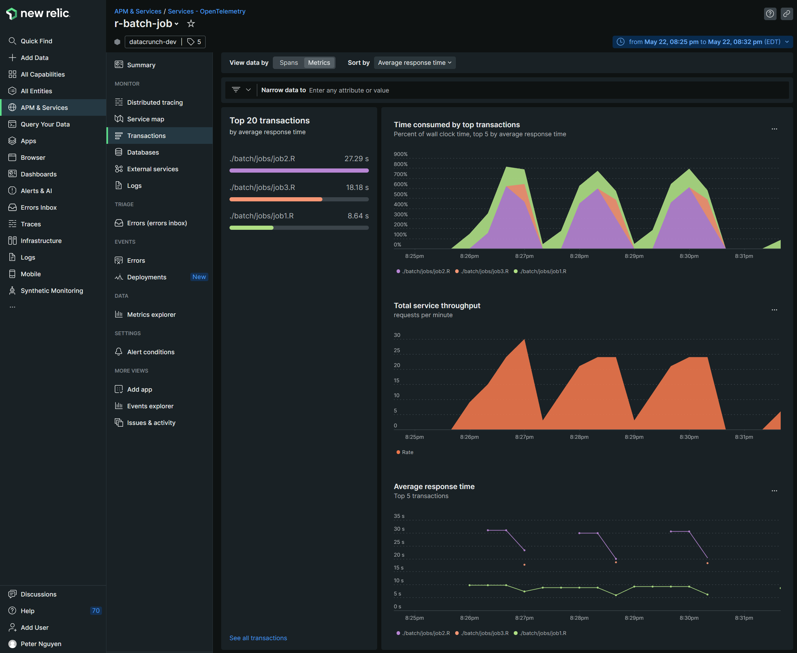
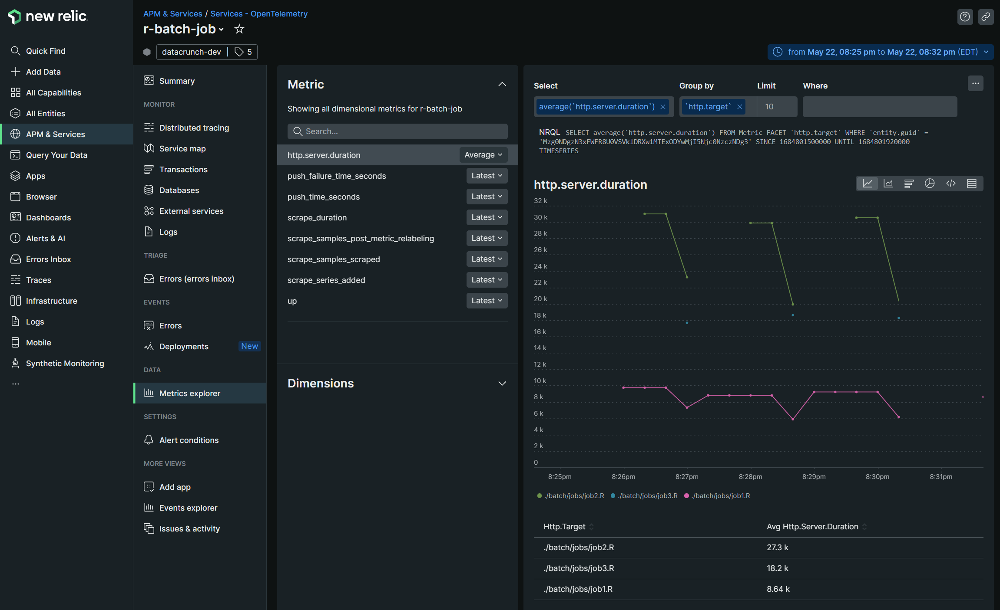

# R - Batch Job Monitoring

## Prerequsites
1. Download and install R.

2. For Windows: Add this to a `Path` environment variable (change version as needed)
   ```
   C:\Program Files\R\R-4.3.0\bin
   ```

3. Launch `R.exe` or `R.app` and install the following packages:
   ```
   install.packages("openmetrics")
   install.packages("httr")
   ```

4. Download [`otelcol-contrib`](https://github.com/open-telemetry/opentelemetry-collector-releases/releases) and extract somewhere.

# Batch



1. Download and extract `pushgateway` from https://github.com/prometheus/pushgateway/releases (`C:\Program Files\Prometheus Pushgateway` in this example)
2. Run `pushgateway.exe` in a terminal. You may need to allow this over the firewall.
   

   ```PowerShell
   $ProgressPreference = "SilentlyContinue"
   $apppath = "C:\Program Files\Prometheus Pushgateway"
   $version = "1.5.1"
   $gateway = "https://github.com/prometheus/pushgateway/releases/download/v${version}/pushgateway-${version}.windows-amd64.tar.gz"

   mkdir $apppath
   cd $apppath
   Invoke-WebRequest -Uri $gateway -OutFile $apppath\pushgateway.tar.gz
   tar -xzf .\pushgateway.tar.gz --strip-components 1

   .\pushgateway.exe
   ```

3. In another terminal, run your batch job.  This script runs all of the jobs saved in the `./batch/jobs` directory and pushes metrics to the Prometheus Pushgateway once each job is completed.  The original R jobs do not change.
   ```
   Rscript ./batch/batchjob.R
   ```
4. Go to http://localhost:9091/metrics to see the metrics

5. Run the OpenTelemetry Collector with the `otel-config_r-batch.yaml` file.
   ```
   ./otelcol-contrib.exe --config=file:'D:/OpenTelemetry/otel-config_batch.yml'
   ```

# New Relic Example
A new entity should appear under APM & Services > `OpenTelemetry`


Go to the Summary page and click on `Metrics` on the top.


Click on `Transactions` on the left to see performance of each job.


Use the `Metrics Explorer` to see the rest of the captured metrics,

