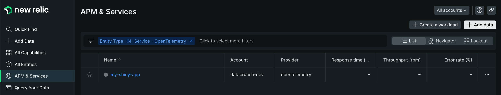
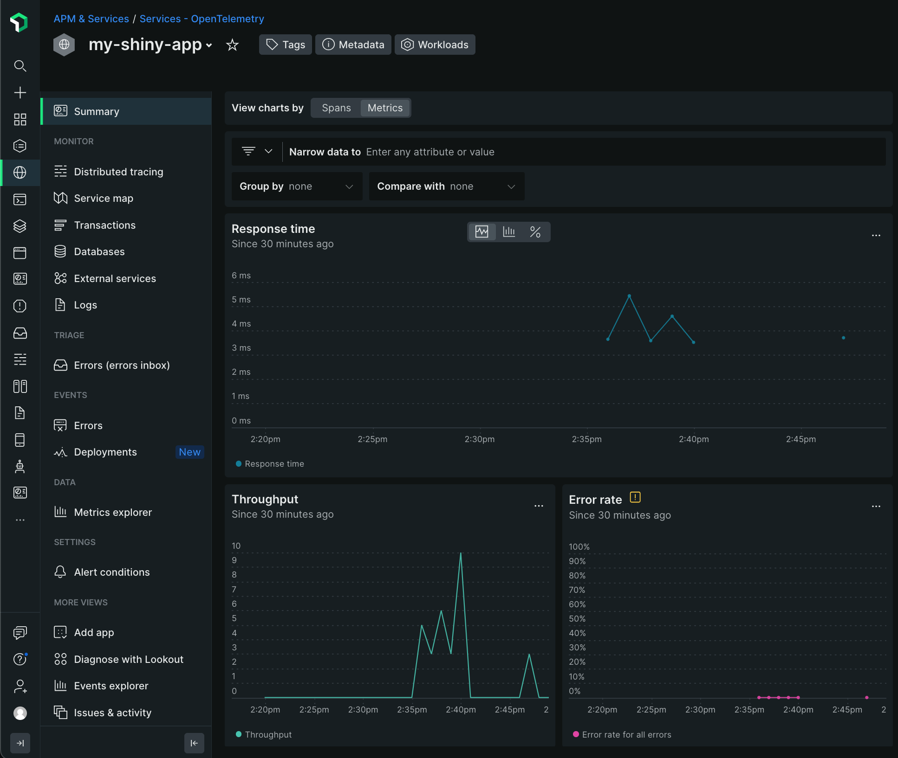
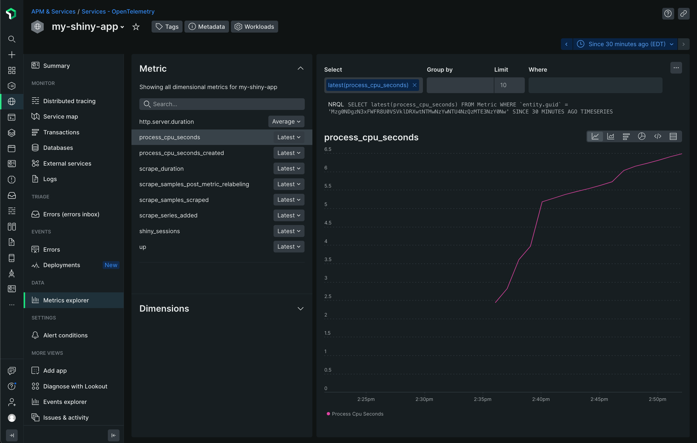

# R - Shiny Application Monitoring

## Prerequsites
1. Download and install R.

2. Add this to a `Path` environment variable (change version as needed)
   ```
   C:\Program Files\R\R-4.3.0\bin
   ```

3. Launch `R.exe` or `R.app` and install the following packages:
   ```
   install.packages("openmetrics")
   install.packages("plumber")
   install.packages("httr")
   ```

4. Download [`otelcol-contrib`](https://github.com/open-telemetry/opentelemetry-collector-releases/releases) and extract somewhere.

# Shiny

1. Run this
   ```
   RScript ./shiny.R
   ```

2. Go to http://127.0.0.1:8000 to generate some traffic.
   

3. Go to http://localhost:8000/metrics to see the following metrics.

    | metric name | metric type |
    | :---------- | :---------- |
    | process_cpu_seconds_total | counter |
    | process_cpu_seconds_total_created | gauge |
    | shiny_sessions | gauge |
    | shiny_flush_duration_seconds | histogram |
    | shiny_flush_duration_seconds_created | gauge |
   
4. Run the OpenTelemetry Collector with the `otel-config_r-shiny.yaml`
   ```
   ./otelcol-contrib.exe --config=file:'./otel-config_r-shiny.yml'
   ```
# New Relic Example
Go to APM & Services > OpenTelemetry to see the Plumber entity.


Check the Summary > Metrics page to see basic information


Finally, go to the `Metrics Explorer` to see everything else.

