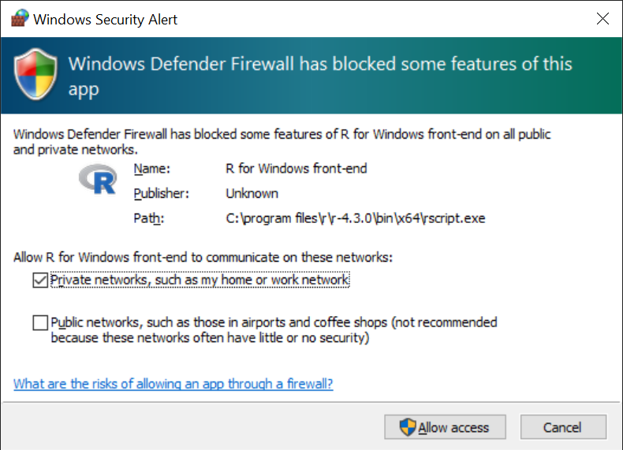
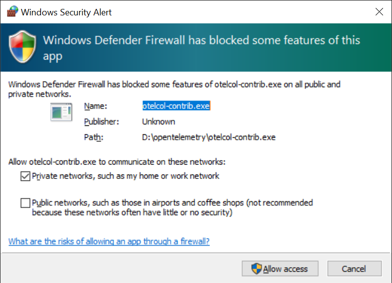
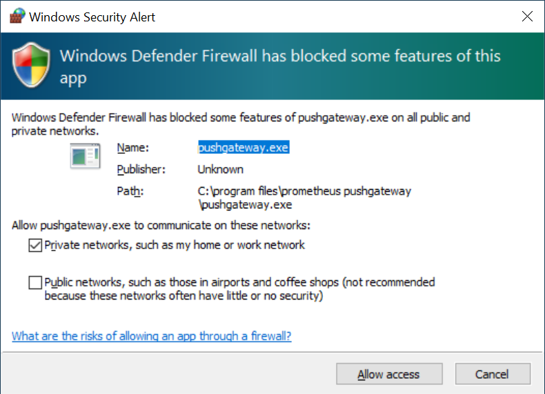
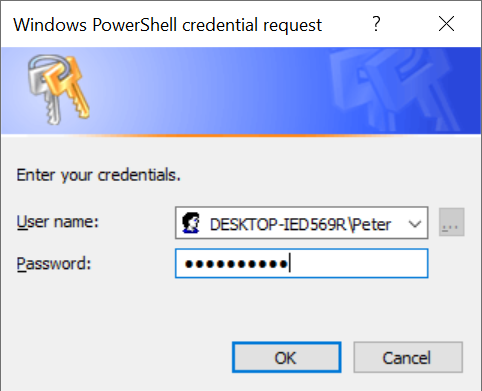
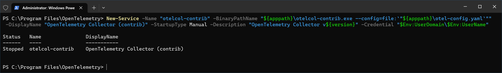
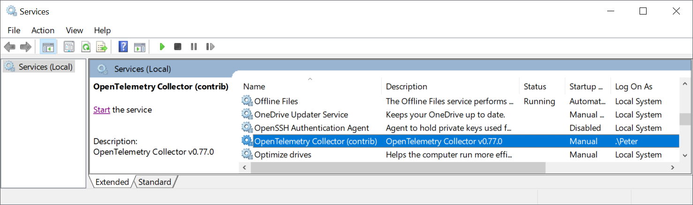
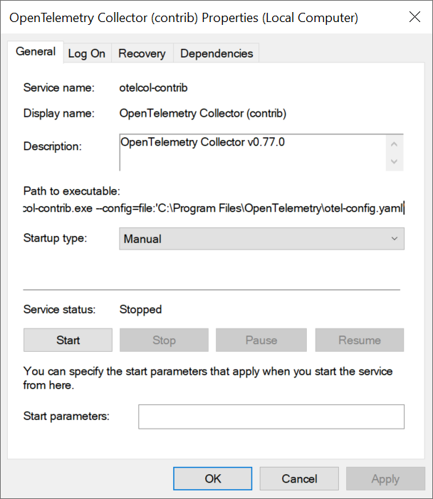

# OpenTelemetry - R

## Prerequsites
1. Download and install R.

2. Add this to a `Path` environment variable (change version as needed)
   ```
   C:\Program Files\R\R-4.3.0\bin
   ```

3. Launch `R.exe` or `R.app` and install the following packages:
   ```
   install.packages("openmetrics")
   install.packages("plumber")
   install.packages("httr")
   ```

4. Download [`otelcol-contrib`](https://github.com/open-telemetry/opentelemetry-collector-releases/releases) and extract somewhere.

## Plumber

1. Run this in a terminal to start the Plumber server.  You may need to allow this app over the firewall.
   ```
   RScript plumberSrv.R
   ```
   

2. Go to http://localhost:8000/metrics to see the following metrics

    | metric name | metric type |
    | :---------- | :---------- |
    | process_cpu_seconds_total | counter |
    | process_cpu_seconds_total_created | gauge |
    | http_request_total | counter |
    | http_request_total_created | gauge |
    | http_request_duration_seconds | histogram |
    | http_request_duration_seconds_created | gauge |
   
3. Run the OpenTelemetry Collector with the `otel-config_plumber.yaml`
   ```
   ./otelcol-contrib.exe --config=file:'D:/OpenTelemetry/otel-config_plumber.yml'
   ```
   

# Batch

1. Download and extract `pushgateway` from https://github.com/prometheus/pushgateway/releases (`C:\Program Files\Prometheus Pushgateway` in this example)
2. Run `pushgateway.exe` in a terminal. You may need to allow this over the firewall.
   

   ```PowerShell
   $ProgressPreference = "SilentlyContinue"
   $apppath = "C:\Program Files\Prometheus Pushgateway"
   $version = "1.5.1"
   $gateway = "https://github.com/prometheus/pushgateway/releases/download/v${version}/pushgateway-${version}.windows-amd64.tar.gz"

   mkdir $apppath
   cd $apppath
   Invoke-WebRequest -Uri $gateway -OutFile $apppath\pushgateway.tar.gz
   tar -xzf .\pushgateway.tar.gz --strip-components 1

   .\pushgateway.exe
   ```

3. Run your batch job
   ```
   Rscript ./batchjob.R
   ```
4. Go to http://localhost:9091/metrics to see the metrics

5. Run the OpenTelemetry Collector with the `otel-config_batch.yaml` file.
   ```
   ./otelcol-contrib.exe --config=file:'D:/OpenTelemetry/otel-config_batch.yml'
   ```

# Shiny

TBD

# OpenTelemetry Collector as a Service

## Windows (Manual)

1. Download and extract the OpenTelemetry Collector somewhere (`C:\Program Files\OpenTelemetry` in this example)
2. Get an OpenTelemetry configuration file and take note of the path and file name (`C:\Program Files\OpenTelemetry\otel-config.yaml` in this example)
3. Create a Windows Service using PowerShell as an Administrator. You'll need to enter your service account credentials.  In this example, the current logged in user is used.
   ```PowerShell
   New-Service -Name "otelcol-contrib" -BinaryPathName "${apppath}\otelcol-contrib.exe --config=file:`"${apppath}\otel-config.yaml`"" -DisplayName "OpenTelemetry Collector (contrib)" -StartupType Manual -Description "OpenTelemetry Collector v${version}" -Credential "$Env:UserDomain\$Env:UserName"
   ```
   
   
4. Start the service with `Start-Service -Name "otelcol-contrib"`
   
   
   
5. (optional) Stop the service with `Stop-Service -Name "otelcol-contrib"`
6. (optional) Delete the service with `Remove-Service -Name "otelcol-contrib"` or for older version of PowerShell:
   ```PowerShell
   (Get-WmiObject -Class Win32_Service -Filter "Name='otelcol-contrib'").delete()
   ```

## Windows (Automated)

```PowerShell
$ProgressPreference = "SilentlyContinue"
$apppath = "C:\Program Files\OpenTelemetry"
$version = "0.77.0"
$otelcol = "https://github.com/open-telemetry/opentelemetry-collector-releases/releases/download/v${version}/otelcol-contrib_${version}_windows_amd64.tar.gz"

mkdir $apppath
cd $apppath
Invoke-WebRequest -Uri $otelcol -OutFile $apppath\otelcol-contrib.tar.gz
tar -xzf .\otelcol-contrib.tar.gz
New-Item otel-config.yaml

New-Service -Name "otelcol-contrib" -BinaryPathName "${apppath}\otelcol-contrib.exe --config=file:`"${apppath}\otel-config.yaml`"" -DisplayName "OpenTelemetry Collector (contrib)" -StartupType Manual -Description "OpenTelemetry Collector v${version}" -Credential "$Env:UserDomain\$Env:UserName"
```
